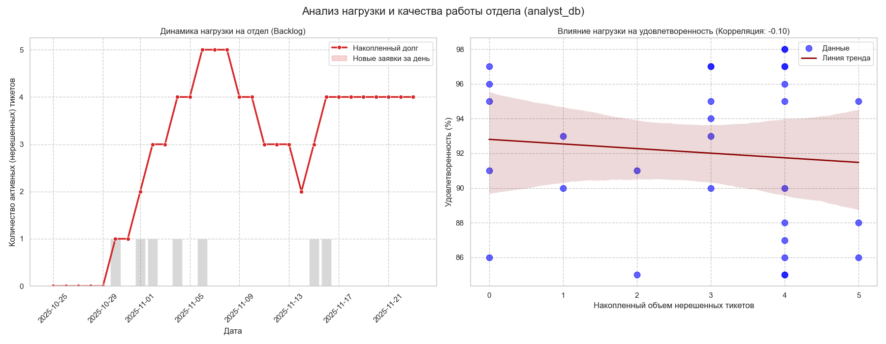

# BMSTU_Python_RK2

# Аналитическая панель: Отдел баз данных (Вариант 6)

## Описание проекта
Данный инструмент разработан для анализа эффективности работы **Отдела баз данных**. Скрипт подключается к API системы технической поддержки, загружает исторические данные за 30 дней и формирует аналитический отчет.

Основная цель — выявить зависимость между рабочей нагрузкой на отдел и уровнем удовлетворенности пользователей (CSAT).

## Источники данных
*   **API Endpoint:** `/api/v1/timeline`
*   **Пользователь:** `analyst_db` (Отдел баз данных)
*   **Используемые метрики:**
    *   `date` (Дата)
    *   `tickets_created` (Создано заявок)
    *   `tickets_resolved` (Решено заявок)
    *   `satisfaction_rate` (Индекс удовлетворенности)

## Методология анализа
Вместо анализа "сырого" количества созданных тикетов (которое скачет день ото дня), мы рассчитываем **Накопительный долг (Backlog)**:

1.  **Ежедневный баланс:** `Создано - Решено`.
2.  **Активные тикеты (Total Active):** Кумулятивная сумма ежедневного баланса.

Это позволяет увидеть реальную картину "завала" в отделе, который накапливается неделями.

## Результаты анализа

Скрипт генерирует комплексную визуализацию, состоящую из двух ключевых графиков:

### 1. Динамика нагрузки на отдел (График слева)
*   **Красная линия:** Общее количество незакрытых тикетов (очередь задач). Рост линии вверх свидетельствует о том, что отдел не успевает обрабатывать входящий поток.
*   **Серые столбцы:** Количество новых заявок, поступающих ежедневно. Позволяет понять, вызван ли рост очереди всплеском заявок или снижением производительности.

### 2. Корреляционный анализ (График справа)
*   **Ось X:** Накопленный объем нерешенных тикетов.
*   **Ось Y:** Удовлетворенность пользователей (%).
*   **Линия тренда:** Показывает направление зависимости.

**Вывод:** На графике наблюдается зависимость между размером очереди и рейтингом. Чем больше задач накапливает отдел, тем ниже падает удовлетворенность пользователей.
